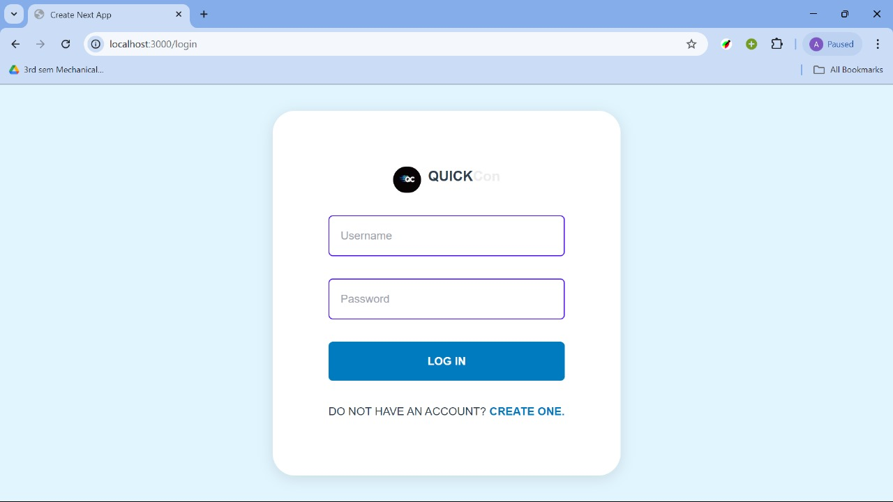

# Chat Application  
[System Design Document](https://docs.google.com/document/d/1-PaUlcVDQhw5Boz_gb005BU5gIp59NAxN5UfA_xW5LA/edit?addon_store)

Name- Himanshu Patel  
University- IIT Dhanbad  
Department- Mechanical engineering

### Introduction
This Chat App is a real-time messaging platform that enables seamless communication between users through both private and group chats. It offers a user-friendly interface along with robust functionality for text communication. Additionally, it features an AI-powered chatbot for enhanced user interaction.

### Features

- User Registration & Authentication: Secure sign-up and login functionalities.
- 

- Real-Time Messaging: Instant messaging with real-time updates using WebSockets, enabling smooth and responsive communication between users.

- Group Chats: Create and participate in group conversations. The app supports group management features like adding/removing members and setting group names.

- AI-Powered Chatbot: Integrated AI chatbot to assist users in conversations or answer frequently asked questions.

- Responsive UI: A responsive and user-friendly design built using Next.js, ensuring the app works well on both desktop and mobile devices.

# Technology Stack
- Frontend :  Tailwind CSS , NextJs 
- Backend : NodeJs , ExpressJs , Socket.io
- Database : MongoDB
- Email Notifications : Nodemailer for sending email alerts
- Encryption : JWT encryption for secure data transmission

# How To Use

You can have this application up and running with just a few steps because it has both the frontend and backend in a single repository. Follow the steps below to do so:

1. Clone this repository using `git clone`.
2. Once you have the repo, you need to install its dependencies. So using the terminal, move into the client directory using `cd client` command as well as into the server directory using `cd server` command and use the `npm i` command to install dependencies at both the locations.
3. In the client directory, simply run `npm run dev`. This command will run the frontend. Also, create an .env file in the root folder and add *NEXT_PUBLIC_LOCALHOST_KEY="chat-app-current-user"* to it.
4. This application uses MongoDB as its Database. So make sure you have it installed. Once installed, make sure you edit the `MongoURL` and `PORT` by creating the .env file.
